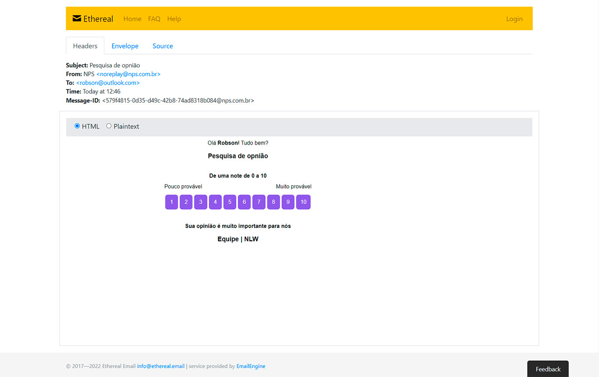

<p align="center">

</p>

<br>

Project create at the 4th edition of [Next Level Week](https://lp.rocketseat.com.br/nlw) by Rocketseat.

<hr>
<br>

- [Description](#description)
- [Stack and tools](#stack-and-tools)
- [Quickstart](#quickstart)
- [Api Routes](#api-routes)
- [Demo](#demo)

<br>

## Description

[Net promoter score (NPS)](https://en.wikipedia.org/wiki/Net_promoter_score) is a widely used market research metric that is based on a single survey question asking respondents to rate the likelihood that they would recommend a company, product, or a service to a friend or colleague.

<p align="center">

</p>

## Stack and tools
* [NodeJS](https://nodejs.org/en/)
* [Typescript](https://www.typescriptlang.org/)
* [TypeORM](https://typeorm.io/#/)
* [Sqlite](https://www.sqlite.org/index.html)
* [Jest](https://jestjs.io/)
* [Nodemailer](https://nodemailer.com/about/)
* [Ethereal](https://ethereal.email/)
* [Handlebars](https://handlebarsjs.com/)
* [Yup](https://github.com/jquense/yup)

## Quickstart

```bash
# Install Dependencies
$ yarn install

# Create the database
$ yarn typeorm migration:run

# Run Aplication
$ yarn dev

# To run the test use
$ yarn test
```

## API Routes

#### POST
- http://localhost:3333/users (create user)
- http://localhost:3333/surveys (create survey)
- http://localhost:3333/sendMAil (send email)

#### GET
- http://localhost:3333/surveys (shows all registered surveys)
- http://localhost:3333/answers/:value (records the response that a user gave to the survey)
- http://localhost:3333/nps/:survey_id (calculates the NPs of a given research from its ID)


## Demo

<p align="center">

</p>
